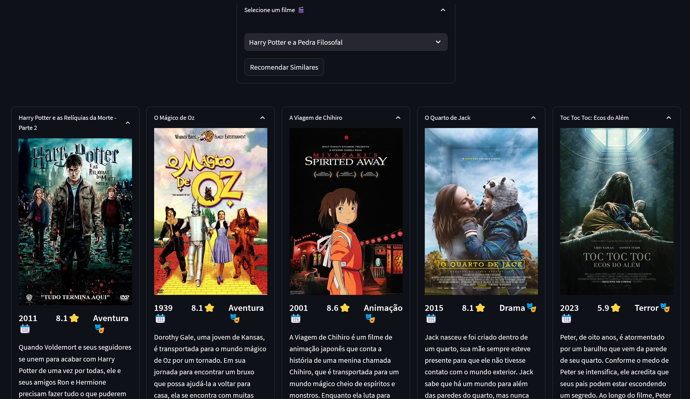

# Movie Recommendator

 
 

## Hosting

The images and assets for this project are hosted on Google Cloud. You can access them at the following URLs:

- [Web App Assets](https://web-app-olylq7xdoa-rj.a.run.app)
- [Movie API Assets](https://movieapi-olylq7xdoa-rj.a.run.app/v1/docs)

## Technology and Resources

- [Python 3.10](https://www.python.org/downloads/release/python-31010/) - **pre-requisite**
- [Docker](https://www.docker.com/get-started) - **pre-requisite**
- [Docker Compose](https://docs.docker.com/compose/) - **pre-requisite**
- [Poetry](https://python-poetry.org/)
- [FastAPI](https://github.com/tiangolo/fastapi)
- [Streamlit](https://docs.streamlit.io/)
- [Uvicorn](https://github.com/encode/uvicorn)

*Please pay attention on **pre-requisites** resources that you must install/configure.*

#### Routes

- `/`: The root path is a redirect to `/docs`
- `/docs`: Swagger
- `/health-check`: Verify sure the application is up
- `/all-movies`: Get all movies names
- `/recommend`: Recommend movies
- `/info`: Get movie info

*The api will be running at `http://localhost:8000/v1`*

The `entrypoint` of the api is the `run.py` file on the api foulder.

#### Frontend

*The frontend will be running at `http://localhost:8501/`*

The `entrypoint` of the frontend project is the `main.py` file on the frontend foulder.

### Content

The Movie Recommender is a comprehensive system designed for efficient and personalized movie recommendations. This project showcases how TF-IDF, KNN, data scraping, and advanced models like GPT can revolutionize the movie recommendation experience. The repository offers tools for extracting movie data from platforms such as IMDb, refining movie synopses using the GPT model, and suggesting movies based on cosine distance of the synopses.

### Webscraping Notebook

The `Webscraping` notebook is dedicated to the process of extracting data from the web. In the context of our movie recommendation project:

- **Purpose**: This notebook is used to gather movie data from IMDB. This could include movie titles, synopses, genres, ratings, and other relevant details that are essential for building a recommendation system.

- **Functionality**: The notebook contains scripts that automate the process of visiting web pages, navigating through them, and extracting the required data.

### GPT Notebook

The `GPT` notebook focuses on the utilization of the Generative Pre-trained Transformer (GPT) model specifically for enhancing movie synopses:

- **Purpose**: This notebook employs the GPT model to refine and possibly generate more detailed or engaging movie synopses. Given the vast knowledge and language capabilities of GPT, it can take basic synopses and transform them into more descriptive and captivating summaries.

- **Functionality**: The notebook contains scripts to load a pre-trained GPT model. It then processes the existing movie synopses from the dataset and uses the model to generate enhanced versions. There might also be steps to fine-tune the GPT model on the movie dataset to make its outputs more aligned with the context of movies.

### Recommendation Methodology

The methodology used for recommending movies is as follows:

1. **Data Loading**: The movie data is loaded from a CSV file named `all_movies.csv` into a dataframe.
2. **Text Vectorization**: The synopsis of each movie (`sinopse_aprimorada`) is vectorized using the TF-IDF (Term Frequency-Inverse Document Frequency) method. This results in a matrix (`tfidf_matrix`) where each row represents a movie and each column represents a term's TF-IDF score.
3. **Movie Indexing**: For a given movie title, its index in the dataframe is retrieved.
4. **Movie Vector Retrieval**: For a given movie index, its corresponding vector from the `tfidf_matrix` is retrieved.
5. **K-Nearest Neighbors**: Using the movie vector, the K-Nearest Neighbors algorithm is applied to find movies that are similar to the given movie. This is done using a pre-trained model that has been fit with the `tfidf_matrix`.
6. **Recommendation Generation**: The distances and indices of the K-Nearest Neighbors are retrieved. These are paired and sorted based on distances. Movie titles corresponding to the sorted indices are retrieved, ensuring that the given movie and any other movies in the blacklist are excluded. The resulting list of movie titles is the recommended movies.
7. **Random Movie Retrieval**: There's also a function to retrieve a random movie title from the dataframe.

### Members

* [@kndhvh](https://github.com/KndHvH)
* [@The-Icaro](https://github.com/The-Icaro)
* [@eduardomatoss](https://github.com/eduardomatoss)
* [@cesarnorena](https://github.com/cesarnorena)

